# 🚀 Hybrid Framework
**Advanced Page Object Model - (v0.6.0)**
> Enterprise-grade test automation framework with Page Object Model, advanced driver management, and multi-browser support

---

## 📛 Category Badges
### Version & Activity


### CI/CD & Quality


### Tech Stack


### Project Health


---

## 📚 Table of Contents
- [🚀 Project Overview](#-project-overview)
- [🏗️ Architecture](#-architecture)
- [✨ Features](#-features)
- [📁 Project Structure](#-project-structure)
- [⚡ Quick Start](#-quick-start)
- [🔧 Configuration](#-configuration)
- [🌿 Branch Strategy](#-branch-strategy)
- [🔄 CI/CD Pipeline](#-cicd-pipeline)
- [📊 Milestones](#-milestones)
- [🤝 Contributing](#-contributing)
- [👨‍💻 Author](#-author)
- [📜 License](#-license)

---

## 🚀 Project Overview
### 🎯 What is This Framework?
A modern, scalable test automation framework built with Java, Selenium WebDriver, and TestNG, implementing Page Object Model pattern for enterprise-level testing with comprehensive error handling and reporting.

### 🏆 Current Release: v0.6.0
Page Object Model Implementation - Implementing robust POM pattern, page factory, and reusable page components.
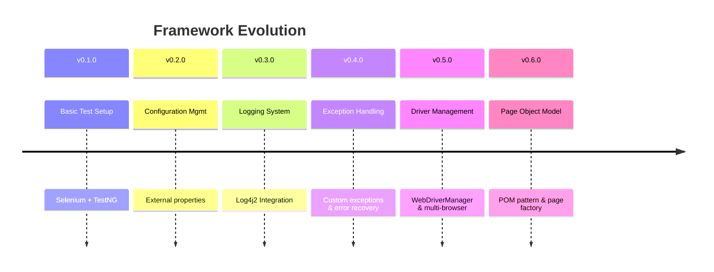
---

## 🏗️ Architecture
### 🔬 High-Level Architecture
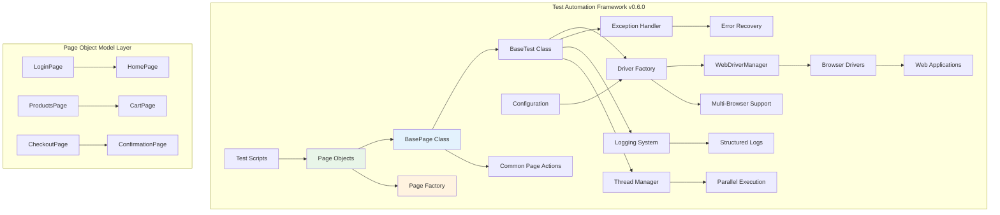

### 🔄 Page Object Model Flow
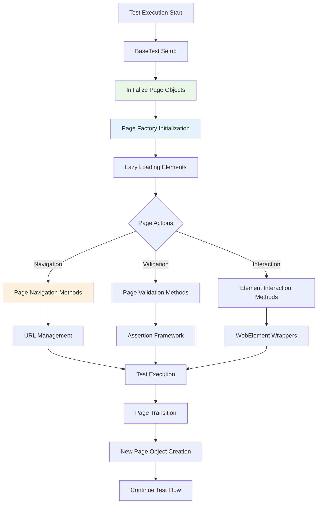
---

## ✨ Features
## 🎯 Core Framework Features
| Feature                | Version | Status       | Description                              |
|------------------------|---------|--------------|------------------------------------------|
| Page Object Model      | v0.6.0  | ✅ Completed | Robust POM pattern with page factory      |
| Driver Management      | v0.5.0  | ✅ Completed | WebDriverManager with automatic handling |
| Multi-Browser Support  | v0.5.0  | ✅ Completed | Chrome, Firefox, Edge, Safari support    |
| Thread-Safe Operations | v0.5.0  | ✅ Completed | ThreadLocal-based driver management      |
| Abstract Base Test     | v0.5.0  | ✅ Completed | Centralized test setup/teardown          |
| Exception Handling     | v0.4.0  | ✅ Completed | Graceful recovery with custom exceptions |
| Structured Logging     | v0.3.0  | ✅ Completed | Log4j2 for console & file logging        |
| Config Management      | v0.2.0  | ✅ Completed | Externalized config.properties           |

### 📄 Page Object Model Features
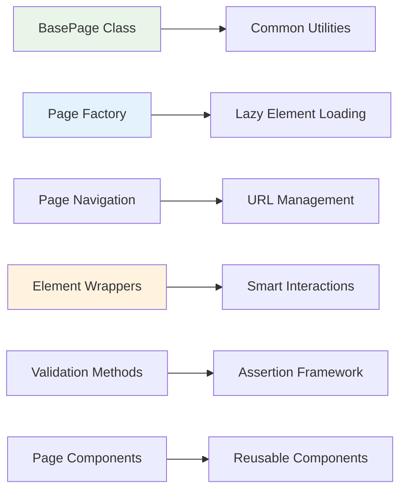

### 🌐 Browser Support Matrix
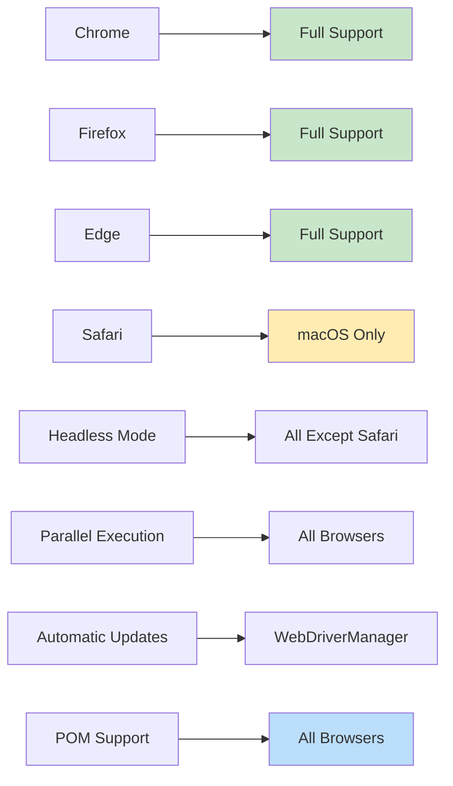
### 🔧 Technical Specifications
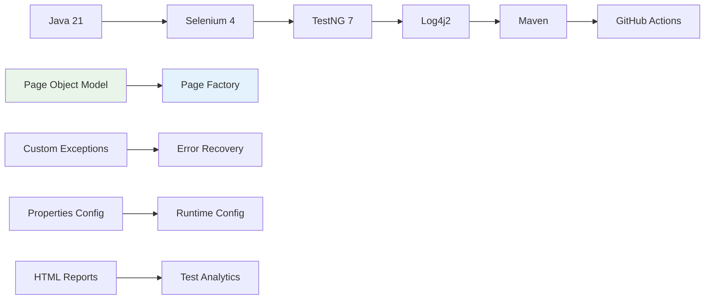
---

## 📁 Project Structure
### 🗂️ Complete Directory Layout
```text
hybrid-framework/
├── 📁 src/
│   ├── 📁 main/
│   │   └── 📁 resources/
│   │       └── 🎯 log4j2.xml                 # Logging configuration
│   └── 📁 test/
│       ├── 📁 java/
│       │   ├── 📁 base/                      # Base test classes
│       │   │   └── 🎯 BaseTest.java          # Abstract base test class
│       │   ├── 📁 config/
│       │   │   └── 🎯 Configuration.java     # Configuration manager
│       │   ├── 📁 drivers/                   # Driver management
│       │   │   ├── 🎯 DriverManager.java     # Thread-safe driver management
│       │   │   └── 🎯 DriverFactory.java     # Multi-browser factory
│       │   ├── 📁 exceptions/                # Exception classes
│       │   │   ├── 🎯 FrameworkException.java
│       │   │   └── 🎯 ElementNotFoundException.java
│       │   ├── 📁 pages/                     # 🆕 Page Object Model
│       │   │   ├── 🎯 BasePage.java          # Abstract base page class
│       │   │   ├── 🎯 LoginPage.java         # Login page implementation
│       │   │   ├── 🎯 HomePage.java          # Home page implementation
│       │   │   └── 🎯 ProductsPage.java      # Products page implementation
│       │   └── 📁 tests/
│       │       └── 🎯 TextBoxTest.java       # Test class extending BaseTest
│       └── 📁 resources/
│           └── 🎯 config.properties          # Test configuration
├── 📁 logs/                                  # Generated log files
├── 📁 .github/
│   ├── 📁 workflows/                         # CI/CD pipelines
│   ├── 📁 issues/                            # Issue templates
│   ├── 📁 features/                          # Feature PR templates
│   └── 📁 releases/                          # Release templates
├── 🎯 pom.xml                               # Maven configuration
└── 🎯 README.md                             # Project documentation
```
### 🔍 Page Object Model Architecture
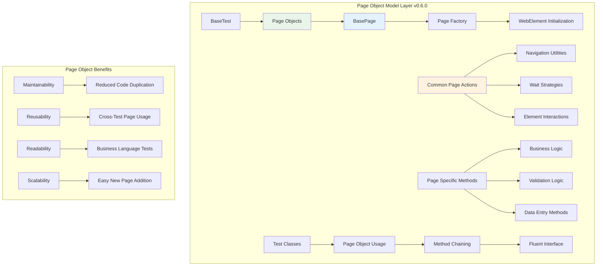
---

## ⚡ Quick Start
### 🚀 5-Minute Setup
```bash
# 1. Clone the repository
git clone https://github.com/Anuj-Patiyal/hybrid-framework.git
cd hybrid-framework

# 2. Run tests with automatic driver setup
mvn clean test

# 3. Check multi-browser support
# Edit config.properties and change browser
```
### 🎛️ Browser Configuration Examples
**Run with Chrome:**
```properties
browser=chrome
headless=true
```
**Run with Firefox:**
```properties
browser=firefox
headless=true
```
**Run with Edge:**
```properties
browser=edge
headless=true
```

### ✅ Prerequisites Checklist
- Java 21 or higher installed
- Maven 3.6+ configured 
- Git for version control 
- Chrome/Firefox browsers available

### 🧪 Test Execution Commands
```bash
# Run all tests with default browser
mvn clean test

# Run with specific browser
mvn test -Dbrowser=firefox

# Run in headed mode for debugging
mvn test -Dheadless=false

# Generate test reports
mvn surefire-report:report
```
---

## 🔧 Configuration
### ⚙️ Configuration Files

**src/test/resources/config.properties**
```properties
# =============================================
# BROWSER CONFIGURATION
# =============================================
browser=chrome
headless=true
window.width=1920
window.height=1080

# =============================================
# TEST ENVIRONMENT
# =============================================
base.url=https://demoqa.com
timeout.explicit=10
timeout.page.load=30
implicit.wait=10

# =============================================
# DRIVER MANAGEMENT
# =============================================
driver.manager.enabled=true
driver.auto.download=true

# =============================================
# LOGGING CONFIGURATION
# =============================================
logging.level=INFO
logging.file=logs/DemoQA.log
```
### 🌐 Multi-Browser Configuration Examples
**Chrome Configuration:**
```properties
browser=chrome
headless=true
chrome.disable.extensions=true
chrome.remote.allow.origins=*
```

**Firefox Configuration:**
```properties
browser=firefox
headless=true
firefox.disable.extensions=true
firefox.log.level=warn
```

**Edge Configuration:**
```properties
browser=edge
headless=true
edge.disable.extensions=true
edge.remote.allow.origins=*
```

### 🔄 Runtime Usage
```java
// In your test classes extending BaseTest
public class YourTest extends BaseTest {
    
    @Test
    public void yourTestMethod() {
        // Driver is automatically available
        driver.get("https://example.com");
        
        // Wait strategy is pre-configured
        wait.until(ExpectedConditions.visibilityOfElementLocated(By.id("element")));
        
        // Navigation utilities available
        navigateTo("/specific-page");
    }
}
```
---

## 🌿 Branch Strategy
### 🔀 Git Workflow

### 📋 Branch Types

| Branch  | Purpose	            | Naming Convention    | Example                   |
|---------|---------------------|----------------------|---------------------------|
| main    | Production releases | main                 | main                      |
| dev     | Integration branch  | dev                  | dev                       |
| feature | New features        | feature/description  | feature/pom               | 
| release | Release preparation | release/version      | release/v0.6.0            |
| hotfix  | Critical fixes	    | hotfix/description   | hotfix/driver-fix         |

---

## CI/CD Pipeline
### 🏗️ Enhanced Pipeline Architecture
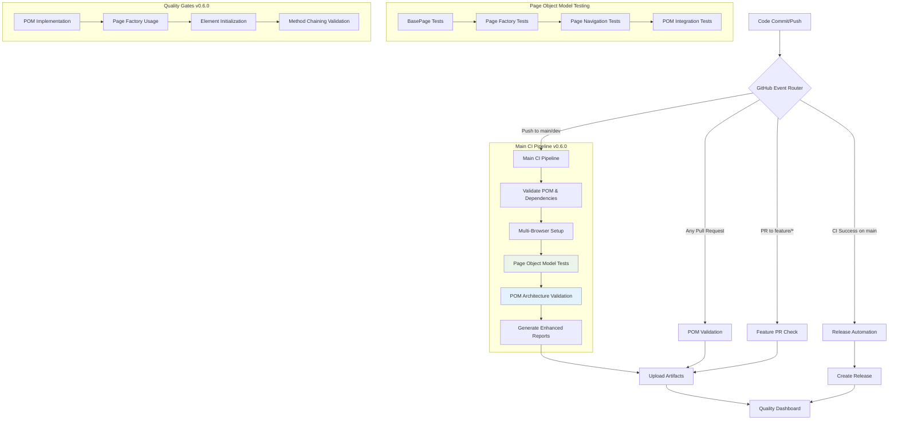

### 📊 Pipeline Metrics v0.5.0
| Metric                 | Current    | Target     | Status |
|------------------------|------------|------------|--------|
| Build Time             | ~3m 45s    | < 5m       | ✅     |
| Multi-Browser Coverage | 4 Browsers | 4 Browsers | ✅     |
| Test Pass Rate         | 100%       | > 95%      | ✅     |
| POM Implementation     | Complete   | 100%       | ✅     |
| Code Maintainability   | Improved   | High       | ✅     |
---

## 📊 Milestones
### 🎯 Release Timeline
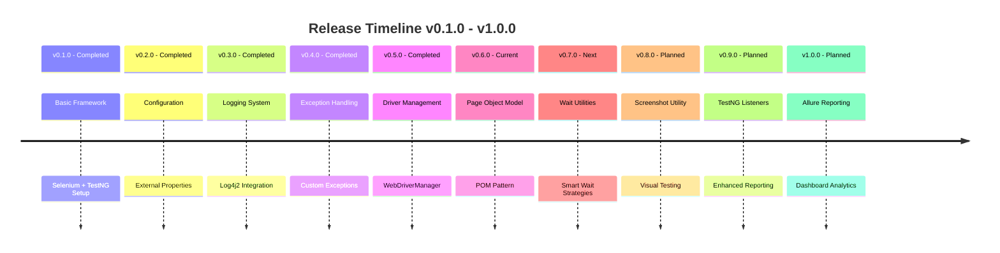
### 🗓️ Version Roadmap
| Version | Feature             | Status         | Release Date | Progress |
|---------|---------------------|----------------|---------------|---------|
| v0.6.0  | Page Object Model   | ✅ Completed   | Oct 30, 2025  | 🟢 100%  |
| v0.7.0  | Wait Utilities      | 🔄 In Progress | Nov 03, 2025  | 🟡 40%   |
| v0.8.0  | Screenshot Utility  | ⏳ Planned	     | Nov 07, 2025  | ⚪ 0%    |
| v0.9.0  | TestNG Listeners    | ⏳ Planned     | Nov 11, 2025  | ⚪ 0%    |
| v1.0.0  | Allure Reporting    | ⏳ Planned	     | Nov 15, 2025  | ⚪ 0%    |

### 🚀 Upcoming Features
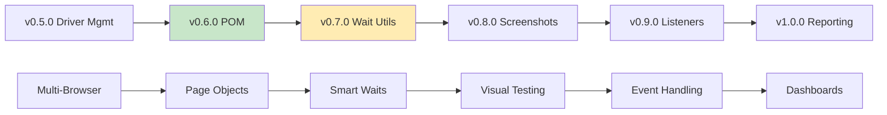

---

## 🤝 Contributing
### 🔄 Contribution Workflow
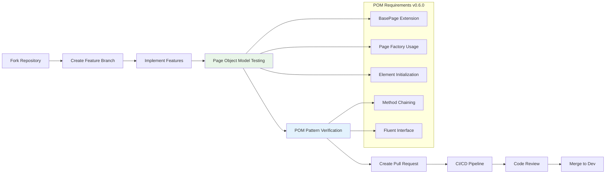
### 📋 Contribution Guidelines
#### ✅ Code Standards
- Follow Java naming conventions
- Use custom exceptions appropriately
- Include comprehensive logging
- Write meaningful commit messages

#### ✅ Testing Requirements
- All new features must include tests
- Exception scenarios must be tested
- Maintain or improve test coverage
- Verify logging output

#### ✅ Documentation
- Update README for new features
- Document exception scenarios
- Include configuration changes
- Update architecture diagrams

#### 🎯 Pull Request Checklist
- Code Quality
- Custom exceptions used appropriately
- Error messages are descriptive
- Resource cleanup implemented
- Logging integrated properly

#### Testing
- All tests pass
- New tests added for features
- Exception scenarios covered
- CI/CD pipeline successful

#### Documentation
- README updated if needed
- Code comments added
- Configuration documented
- Architecture diagrams updated

### 🎯 Pull Request Checklist v0.5.0
- Driver Management
    - WebDriverManager integration working
    - Multi-browser support verified
    - Thread-safe operations implemented
    - Driver cleanup properly handled

- Testing
    - All browsers tested (Chrome, Firefox, Edge)
    - Headless mode verified
    - Parallel execution compatibility
    - Existing tests passing
    
- Code Quality
    - BaseTest extension implemented
    - Configuration properly utilized
    - Exception handling integrated
    - Logging comprehensive
---

## 👤 Author
### 🏆 ANUJ KUMAR
**QA Consultant & Test Automation Architect**
### 📬 Contact Details

| Type             | Details                                                              |
|------------------|----------------------------------------------------------------------|
| 📧 **Email**     | [anujpatiyal@live.in](mailto:anujpatiyal@live.in)                    |
| 🔗 **LinkedIn**  | [Anuj Kumar – QA](https://www.linkedin.com/in/anuj-kumar-qa/)        |
| 🏢 **GitHub**    | [Anuj-Patiyal](https://github.com/Anuj-Patiyal)                      |
| 💼 **Portfolio** | [Hybrid Framework](https://github.com/Anuj-Patiyal/hybrid-framework) |

### 🔧 Technical Expertise
- **Test Automation**           : Selenium, TestNG, WebDriverManager, Multi-Browser
- **Framework Architecture**    : Driver Management, Page Object Model, CI/CD
- **Programming**               : Java 21, Design Patterns, Exception Handling
- **DevOps**                    : GitHub Actions, Maven, Docker, Parallel Execution
- **Quality Engineering**       : Test Strategy, Automation Planning, Code Quality
---

## 📜 License
```text
Copyright (c) 2025 ANUJ KUMAR

Permission is hereby granted, free of charge, to any person obtaining a copy
of this software and associated documentation files (the "Software"), to deal
in the Software without restriction, including without limitation the rights
to use, copy, modify, merge, publish, distribute, sublicense, and/or sell
copies of the Software, and to permit persons to whom the Software is
furnished to do so, subject to the following conditions:

The above copyright notice and this permission notice shall be included in all
copies or substantial portions of the Software.

THE SOFTWARE IS PROVIDED "AS IS", WITHOUT WARRANTY OF ANY KIND, EXPRESS OR
IMPLIED, INCLUDING BUT NOT LIMITED TO THE WARRANTIES OF MERCHANTABILITY,
FITNESS FOR A PARTICULAR PURPOSE AND NONINFRINGEMENT. IN NO EVENT SHALL THE
AUTHORS OR COPYRIGHT HOLDERS BE LIABLE FOR ANY CLAIM, DAMAGES OR OTHER
LIABILITY, WHETHER IN AN ACTION OF CONTRACT, TORT OR OTHERWISE, ARISING FROM,
OUT OF OR IN CONNECTION WITH THE SOFTWARE OR THE USE OR OTHER DEALINGS IN THE
SOFTWARE.
```

### 💡 **Open Source Philosophy**
*"First, solve the problem. Then, write the code."* – John Johnson

This framework embodies robust engineering principles with enterprise-grade exception handling and structured logging for reliable test automation.

<div align="center">

🚀 **Ready to automate with confidence?**
⭐ **Star this repository if you find it helpful!**

[🌟 Star on GitHub](https://github.com/Anuj-Patiyal/hybrid-framework) • [🐛 Report Issue](https://github.com/Anuj-Patiyal/hybrid-framework/issues) • [💡 Request Feature](https://github.com/Anuj-Patiyal/hybrid-framework/discussions)

</div>
---

