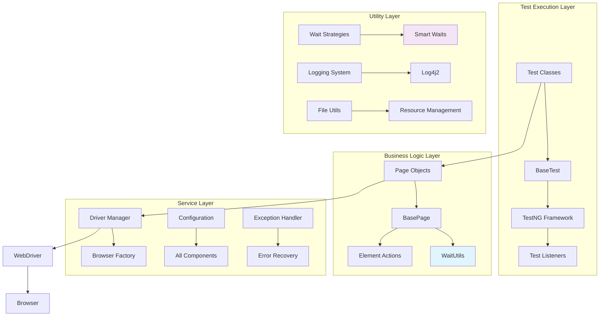
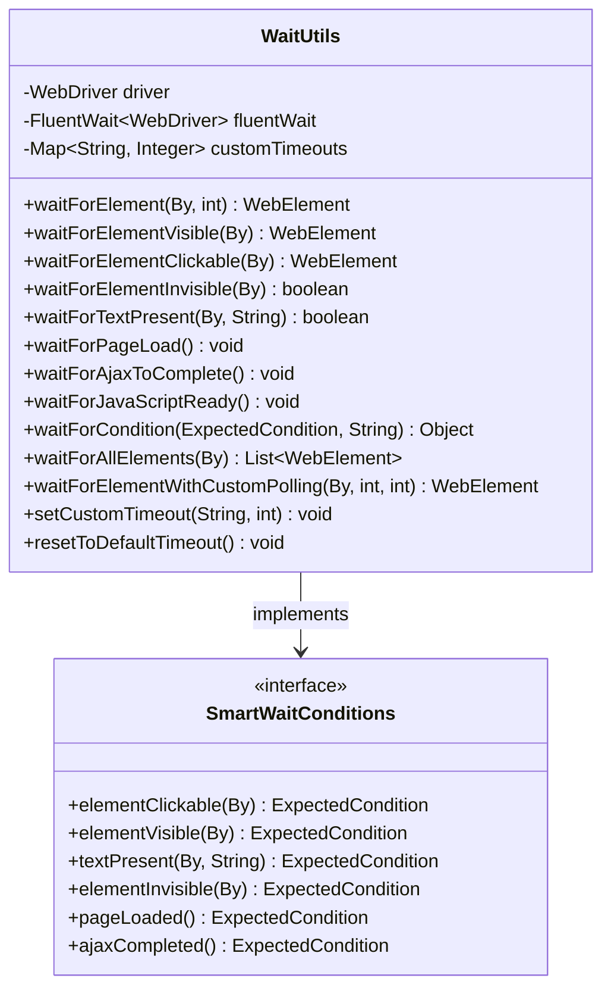
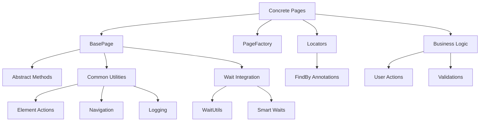
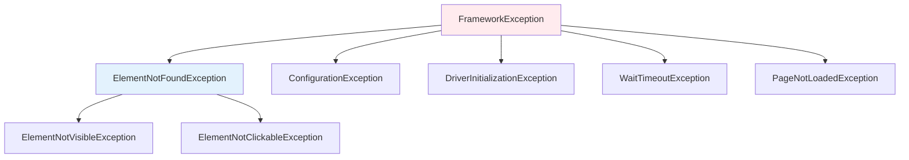
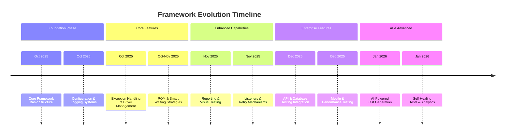

# 🚀 Hybrid Framework
## Version & Activity


## CI/CD & Quality


## Tech Stack


## Project Health


**Enterprise-Grade Test Automation Framework with AI-Ready Architecture**

> ***A robust, scalable, and maintainable test automation framework built with Java, Selenium, and TestNG featuring smart waiting strategies, comprehensive reporting, and CI/CD integration***
---

# 📖 Table of Contents
- [🌟 Framework Overview](#-framework-overview)
- [🏗️ Architecture Design](#-architecture-design)
- [⚡ Quick Start Guide](#-quick-start-guide)
- [🎯 Core Features](#-core-features)
- [⏱️ Smart Waiting Strategy (v0.7.0)](#-smart-waiting-strategy-v070)
- [🏗️ Page Object Model (v0.6.0)](#-page-object-model-v060)
- [🎮 Driver Management (v0.5.0)](#-driver-management-v050)
- [🛡️ Exception Handling (v0.4.0)](#-exception-handling-v040)
- [⚙️ Configuration Management](#-configuration-management)
- [📊 Logging System (v0.3.0)](#-logging-system-v030)
- [🔄 CI/CD Pipeline](#-cicd-pipeline)
- [🧪 Test Execution](#-test-execution)
- [📁 Project Structure](#-project-structure)
- [🗺️ Development Roadmap](#-development-roadmap)
- [🤝 Contribution Guidelines](#-contribution-guidelines)
- [📚 API Reference](#-api-reference)
- [❓ FAQ](#-faq)
- [📄 License](#-license)
---

## 🌟 Framework Overview
The Java Selenium Hybrid Automation Framework is an enterprise-grade testing solution designed for modern web applications. 
It combines the power of Selenium WebDriver with robust design patterns, smart utilities, and comprehensive tooling to deliver reliable, maintainable, and scalable test automation.

### 🎯 Key Benefits
- 🚀 **Reduced Test Flakiness:** Smart waiting strategies and robust error handling
- 📈 **Enhanced Maintainability:** Clean architecture and separation of concerns
- ⚡ **Improved Productivity:** Pre-built utilities and configuration management
- 🔧 **Easy Extensibility:** Modular design for easy feature additions
- 🌐 **Cross-Browser Support:** Comprehensive browser compatibility
- 📊 **Comprehensive Reporting:** Detailed logs and test execution reports

---

## 🏗️ Architecture Design
### System Architecture Diagram


### Component Interaction Flow
```text
┌─────────────────┐    ┌─────────────────┐    ┌─────────────────┐
│   Test Class    │ ─→ │   Page Object   │ ─→ │   WaitUtils     │
└─────────────────┘    └─────────────────┘    └─────────────────┘
         │                       │                       │
         ↓                       ↓                       ↓
┌─────────────────┐    ┌─────────────────┐    ┌─────────────────┐
│   BaseTest      │ ←→ │   BasePage      │ ←→ │  WebDriver      │
└─────────────────┘    └─────────────────┘    └─────────────────┘
         │                       │                       │
         ↓                       ↓                       ↓
┌─────────────────┐    ┌─────────────────┐    ┌─────────────────┐
│  TestNG         │    │  Configuration  │    │  Browser        │
│  Annotations    │    │  Manager        │    │  Instance       │
└─────────────────┘    └─────────────────┘    └─────────────────┘
```
### Design Patterns Implemented
- **Factory Pattern:** Driver initialization and management
- **Page Object Model:** UI element encapsulation and business logic
- **Singleton Pattern:** Configuration and driver manager instances
- **Strategy Pattern:** Multiple waiting strategies
- **Builder Pattern:** Complex test data creation (planned)
- **Facade Pattern:** Simplified complex subsystem interactions

---

## ⚡ Quick Start Guide
### 🛠️ Prerequisites
- Java 21 or higher [Download](https://www.oracle.com/java/technologies/downloads/)
- Maven 3.6+ [Download](https://maven.apache.org/download.cgi)
- Git [Download](https://git-scm.com/downloads)
- Your Favorite IDE ([IntelliJ IDEA](https://www.jetbrains.com/idea/download/), [Eclipse](https://www.eclipse.org/downloads/), or [VS Code](https://code.visualstudio.com/download))

### 🚀 Installation & Setup
1. Clone and Setup
```bash
# Clone the repository
git clone https://github.com/your-org/hybrid-framework.git
cd hybrid-framework

# Verify Java installation
java -version
mvn -version

# Build the project
mvn clean install -DskipTests

# Run initial tests
mvn test 
```

2. IDE Configuration
   **IntelliJ IDEA:**
```xml
<!-- Ensure these settings in pom.xml -->
<properties>
    <maven.compiler.source>21</maven.compiler.source>
    <maven.compiler.target>21</maven.compiler.target>
    <project.build.sourceEncoding>UTF-8</project.build.sourceEncoding>
</properties>
```

**VS Code:**
```json
// .vscode/settings.json
{
    "java.configuration.updateBuildConfiguration": "automatic",
    "java.compile.nullAnalysis.mode": "automatic"
}
```

3. Configuration Setup
```properties
# src/test/resources/config.properties
browser=chrome
headless=false
base.url=https://demoqa.com
timeout.explicit=10
logging.level=DEBUG
```
### 📝 Sample Test Implementation
#### Basic Test Structure
```java
package tests;

import base.BaseTest;
import org.testng.annotations.Test;
import pages.TextBoxPage;

public class TextBoxTest extends BaseTest {

    @Test
    public void testTextBoxFormSubmission() {
        // Navigate to application using smart URL construction
        navigateTo("/text-box");
        
        // Initialize page object with built-in waiting
        TextBoxPage textBoxPage = new TextBoxPage(driver);
        
        // Use fluent API for form filling
        textBoxPage.fillForm(
            "John Doe", 
            "john.doe@example.com", 
            "123 Main Street, Current City", 
            "456 Park Avenue, Permanent City"
        );
        
        // Validate results with automatic waiting
        textBoxPage.validateFormSubmission(
            "John Doe", 
            "john.doe@example.com", 
            "123 Main Street, Current City", 
            "456 Park Avenue, Permanent City"
        );
    }
    
    @Test
    public void testTextBoxWithSmartWaits() {
        navigateTo("/text-box");
        TextBoxPage textBoxPage = new TextBoxPage(driver);
        
        // Direct usage of smart waiting utilities
        getWaitUtils().waitForPageLoad();
        textBoxPage.enterFullName("Smart User");
        
        // Custom waiting scenario
        getWaitUtils().waitForTextPresent(
            org.openqa.selenium.By.id("output"), 
            "Name:Smart User"
        );
    }
}
```
#### Advanced Test with Data Provider
```java
@Test(dataProvider = "formData")
public void testDataDrivenForm(String name, String email, String address) {
    TextBoxPage textBoxPage = new TextBoxPage(driver);
    textBoxPage.fillForm(name, email, address, address);
    // Validation logic here
}

@DataProvider(name = "formData")
public Object[][] provideFormData() {
    return new Object[][] {
        {"User One", "user1@test.com", "Address One"},
        {"User Two", "user2@test.com", "Address Two"},
        {"User Three", "user3@test.com", "Address Three"}
    };
}
```
---

## 🎯 Core Features
### ✅ Implemented Features
| Feature            | Version | Status  | Description                                 |
|--------------------|---------|---------|---------------------------------------------| 
| Smart Waiting      | v0.7.0  | 🟢 Live | Advanced waiting strategies with FluentWait |
| Page Object Model  | v0.6.0  | 🟢 Live | Clean page separation with PageFactory      |
| Driver Management  | v0.5.0  | 🟢 Live | Multi-browser support with thread safety    |
| Exception Handling | v0.4.0  | 🟢 Live | Custom exceptions with meaningful messages  |
| Logging System     | v0.3.0  | 🟢 Live | Structured logging with Log4j2              |
| Configuration Mgmt | v0.2.0  | 🟢 Live | Centralized configuration system            |
| Test Structure     | v0.1.0  | 🟢 Live | Base test class with setup/teardown         |
| Maven Setup        | v0.0.0  | 🟢 Live | Project structure and dependencies          |

### 🚀 Feature Highlights
#### 🔧 Modular Design
- **Pluggable Architecture:** Easy to extend and modify
- **Separation of Concerns:** Clear boundaries between layers
- **Reusable Components:** Shared utilities across the framework

#### 📊 Comprehensive Reporting
- **Structured Logging:** Detailed execution logs
- **TestNG Reports:** HTML and XML test reports
- **Performance Metrics:** Execution time tracking

#### 🌐 Cross-Browser Testing
- **Chrome, Firefox, Edge, Safari:** Full browser support
- **Headless Execution:** CI/CD optimized execution
- **Mobile Emulation:** Responsive testing capabilities

---

## ⏱️ Smart Waiting Strategy (v0.7.0)
### 🎯 Overview
Revolutionary waiting strategy that eliminates test flakiness through intelligent condition-based waiting, dynamic timeout management, and comprehensive exception handling.

### 🏗️ Architecture

### ⚙️ Configuration
#### Properties Configuration
```properties
# Smart Waiting Configuration
wait.polling.interval=500
wait.fluent.timeout=30
wait.ajax.timeout=10
wait.page.load.timeout=30
wait.element.timeout=15
wait.custom.condition.timeout=20
```
# Advanced Wait Settings
wait.ignore.exceptions=NoSuchElementException,StaleElementReferenceException
wait.retry.attempts=3
wait.retry.delay=1000

### Programmatic Configuration
```java
// Custom timeout configuration
WaitUtils waitUtils = new WaitUtils(driver);
waitUtils.setCustomTimeout("LONG_OPERATION", 60);
waitUtils.setCustomTimeout("QUICK_CHECK", 5);

// Dynamic polling configuration
waitUtils.waitForElementWithCustomPolling(
    By.id("dynamic-element"), 
    30,  // timeout
    250  // polling interval
);
```
### 💡 Usage Examples
### Basic Element Waiting
```java
// Wait for element to be visible and clickable
WebElement submitButton = waitUtils.waitForElementClickable(By.id("submit-btn"));

// Wait for element to disappear
boolean isInvisible = waitUtils.waitForElementInvisible(By.id("loading-spinner"));

// Wait for specific text
boolean textPresent = waitUtils.waitForTextPresent(
    By.cssSelector(".status-message"), 
    "Operation Completed"
);
```
### Advanced Page Synchronization
```java
// Comprehensive page load sequence
waitUtils.waitForPageLoad();           // DOM ready
waitUtils.waitForAjaxToComplete();     // AJAX calls done
waitUtils.waitForJavaScriptReady();    // JS execution complete

// Wait for multiple conditions
waitUtils.waitForCondition(
    ExpectedConditions.and(
        ExpectedConditions.visibilityOfElementLocated(By.id("content")),
        ExpectedConditions.invisibilityOfElementLocated(By.id("loader")),
        ExpectedConditions.textToBe(By.id("status"), "Ready")
    ),
    "Waiting for page to be fully ready"
);
```

### Custom Wait Strategies
```java
// Retry mechanism with custom logic
public WebElement waitWithRetry(By locator, int maxAttempts) {
    for (int attempt = 0; attempt < maxAttempts; attempt++) {
        try {
            return waitUtils.waitForElementVisible(locator);
        } catch (FrameworkException e) {
            logger.warn("Attempt {} failed for element: {}", attempt + 1, locator);
            if (attempt == maxAttempts - 1) throw e;
        }
    }
    return null;
}

// Dynamic timeout based on element importance
public WebElement waitWithDynamicTimeout(By locator, ElementPriority priority) {
    int timeout = switch (priority) {
        case CRITICAL -> 60;
        case HIGH -> 30;
        case MEDIUM -> 15;
        case LOW -> 5;
    };
    return waitUtils.waitForElement(locator, timeout);
}
```
### 🎪 Wait Conditions Reference
| Condition            |           Method          | Description                    | Use Case                  |
|----------------------|---------------------------|--------------------------------|---------------------------| 
| Element Presence     | waitForElement()          | Waits for element in DOM       | Basic element existence   |
| Element Visibility   | waitForElementVisible()   | Waits for visible element      | User interactions         |
| Element Clickable    | waitForElementClickable() | Waits for clickable element    | Button clicks             |
| Element Invisibility | waitForElementInvisible() | Waits for element to disappear | Loading spinners          |
| Text Presence        | waitForTextPresent()      | Waits for specific text        | Status messages           |
| Page Load            | waitForPageLoad()         | Waits for page ready state     | Navigation                |
| AJAX Completion      | waitForAjaxToComplete()   | Waits for AJAX calls           | Dynamic content           |
| Custom Condition     | waitForCondition()        | Custom expected condition      | Complex scenarios         |

--- 
## 🏗️ Page Object Model (v0.6.0)
### 🎯 Architecture Overview

### 📝 BasePage Implementation
```java
public abstract class BasePage {
    // Core components
    protected WebDriver driver;
    protected WebDriverWait wait;
    protected WaitUtils waitUtils;
    protected JavascriptExecutor jsExecutor;
    
    // Common utilities for all pages
    public abstract boolean isPageLoaded();
    
    protected void clickElement(WebElement element) {
        // Enhanced click with multiple strategies
    }
    
    protected void sendKeysToElement(WebElement element, String text) {
        // Smart text entry with validation
    }
    
    // Navigation methods
    public void navigateTo(String relativeUrl) {
        // Smart navigation with waiting
    }
    
    // Validation methods
    protected boolean isElementDisplayed(WebElement element) {
        // Safe element visibility check
    }
}
```
### 🎨 Concrete Page Example
```java
public class LoginPage extends BasePage {
    
    // PageFactory locators
    @FindBy(id = "username") private WebElement usernameField;
    @FindBy(id = "password") private WebElement passwordField;
    @FindBy(id = "login-btn") private WebElement loginButton;
    @FindBy(css = ".error-message") private WebElement errorMessage;
    
    public LoginPage(WebDriver driver) {
        super(driver);
        PageFactory.initElements(driver, this);
    }
    
    @Override
    public boolean isPageLoaded() {
        return waitUtils.waitForElementVisible(usernameField).isDisplayed() &&
               waitUtils.waitForElementVisible(loginButton).isEnabled();
    }
    
    // Business logic methods
    public DashboardPage login(String username, String password) {
        logger.info("Attempting login with username: {}", username);
        
        enterUsername(username);
        enterPassword(password);
        clickLogin();
        
        // Wait for navigation and return new page
        waitUtils.waitForPageLoad();
        return new DashboardPage(driver);
    }
    
    public void loginWithInvalidCredentials(String username, String password) {
        login(username, password);
        waitUtils.waitForElementVisible(errorMessage);
    }
    
    // Atomic action methods
    private void enterUsername(String username) {
        waitUtils.waitForElementVisible(usernameField);
        usernameField.clear();
        usernameField.sendKeys(username);
    }
    
    private void enterPassword(String password) {
        waitUtils.waitForElementVisible(passwordField);
        passwordField.clear();
        passwordField.sendKeys(password);
    }
    
    private void clickLogin() {
        waitUtils.waitForElementClickable(loginButton);
        clickElement(loginButton);
    }
    
    // Validation methods
    public boolean isErrorMessageDisplayed() {
        return isElementDisplayed(errorMessage);
    }
    
    public String getErrorMessageText() {
        return waitUtils.waitForElementVisible(errorMessage).getText();
    }
}
```
---
## 🎮 Driver Management (v0.5.0)
### 🌐 Multi-Browser Support
```java
public class DriverFactory {
    
    public static WebDriver createDriver() {
        String browser = Configuration.getBrowser().toLowerCase();
        
        return switch (browser) {
            case "chrome" -> createChromeDriver();
            case "firefox" -> createFirefoxDriver();
            case "edge" -> createEdgeDriver();
            case "safari" -> createSafariDriver();
            default -> throw new FrameworkException("Unsupported browser: " + browser);
        };
    }
    
    private static WebDriver createChromeDriver() {
        ChromeOptions options = new ChromeOptions();
        
        // Performance optimizations
        options.addArguments("--no-sandbox");
        options.addArguments("--disable-dev-shm-usage");
        options.addArguments("--remote-allow-origins=*");
        
        // Ad-blocking and privacy
        options.addArguments("--disable-extensions");
        options.addArguments("--disable-notifications");
        options.addArguments("--disable-blink-features=AutomationControlled");
        
        // Headless configuration
        if (Configuration.isHeadless()) {
            options.addArguments("--headless=new");
        }
        
        return new ChromeDriver(options);
    }
}
```

### 🔒 Thread-Safe Driver Management
```java
public class DriverManager {
    private static final ThreadLocal<WebDriver> driverThreadLocal = new ThreadLocal<>();
    
    public static WebDriver getDriver() {
        if (driverThreadLocal.get() == null) {
            throw new IllegalStateException("WebDriver not initialized");
        }
        return driverThreadLocal.get();
    }
    
    public static void setDriver(WebDriver driver) {
        driverThreadLocal.set(driver);
    }
    
    public static void quitDriver() {
        WebDriver driver = driverThreadLocal.get();
        if (driver != null) {
            driver.quit();
            driverThreadLocal.remove();
        }
    }
}
```
---
## 🛡️ Exception Handling (v0.4.0)
### 🎯 Custom Exception Hierarchy


#### 📝 Exception Implementation
```java
public class FrameworkException extends RuntimeException {
    private final String errorCode;
    private final ZonedDateTime timestamp;
    
    public FrameworkException(String message) {
        super(message);
        this.errorCode = "FRAMEWORK_ERROR";
        this.timestamp = ZonedDateTime.now();
    }
    
    public FrameworkException(String message, Throwable cause) {
        super(message, cause);
        this.errorCode = "FRAMEWORK_ERROR";
        this.timestamp = ZonedDateTime.now();
    }
    
    // Getters and utility methods
    public String getErrorCode() { return errorCode; }
    public ZonedDateTime getTimestamp() { return timestamp; }
    
    public String getFormattedMessage() {
        return String.format("[%s] %s at %s", errorCode, getMessage(), timestamp);
    }
}
```

---

### ⚙️ Configuration Management
#### 🔧 Centralized Configuration
```java
public class Configuration {
    private static final Properties properties = new Properties();
    
    static {
        loadConfiguration();
    }
    
    private static void loadConfiguration() {
        try (FileInputStream fis = new FileInputStream("src/test/resources/config.properties")) {
            properties.load(fis);
            logger.info("Configuration loaded successfully");
        } catch (IOException e) {
            throw new ConfigurationException("Failed to load configuration", e);
        }
    }
    
    // Type-safe configuration access
    public static String getBrowser() {
        return getProperty("browser", "chrome");
    }
    
    public static boolean isHeadless() {
        return Boolean.parseBoolean(getProperty("headless", "true"));
    }
    
    public static int getExplicitWaitTimeout() {
        return getIntProperty("timeout.explicit", 10);
    }
}
```
#### 📋 Configuration Reference
| Category    | Property          | Default            | Description                                 |
|-------------|-------------------|--------------------|---------------------------------------------|
| Browser     | browser	          | chrome             | Target browser (chrome/firefox/edge/safari) |
| Browser     | headless          | true               | Headless mode for CI execution              |
| Environment | base.url          | https://demoqa.com | Base application URL                        |
| Timeouts    | timeout.explicit  | 10                 | Explicit wait timeout in seconds            |
| Timeouts    | timeout.page.load | 30                 | Page load timeout                           |
| Timeouts    | implicit.wait     | 10                 | Implicit wait timeout                       |
| Logging     | logging.level     | INFO               | Logging level (DEBUG/INFO/WARN/ERROR)       |
| Logging     | logging.file      | logs/DemoQA.log    | Log file path                               |

---

### 📊 Logging System (v0.3.0)
#### 🎯 Structured Logging
```xml
<!-- log4j2.xml -->
<Configuration status="WARN">
    <Appenders>
        <Console name="Console" target="SYSTEM_OUT">
            <PatternLayout pattern="%d{HH:mm:ss.SSS} [%t] %-5level %logger{36} - %msg%n"/>
        </Console>
        <File name="File" fileName="logs/DemoQA.log" append="false">
            <PatternLayout pattern="%d{dd-MMM-yyyy HH:mm:ss.SSS} [%t] %-5level %logger{36} - %msg%n"/>
        </File>
    </Appenders>
    <Loggers>
        <Root level="info">
            <AppenderRef ref="Console"/>
            <AppenderRef ref="File"/>
        </Root>
    </Loggers>
</Configuration>
```

#### 💡 Logging Best Practices
```java
public class TextBoxPage extends BasePage {
    private static final Logger logger = LogManager.getLogger(TextBoxPage.class);
    
    public void fillForm(String fullName, String email, String currentAddress, String permanentAddress) {
        logger.info("Starting form fill operation");
        logger.debug("Form data - Name: {}, Email: {}, Current: {}, Permanent: {}", 
                    fullName, email, currentAddress, permanentAddress);
        
        try {
            enterFullName(fullName);
            enterEmail(email);
            // ... more operations
            
            logger.info("Form filled successfully");
        } catch (Exception e) {
            logger.error("Form fill operation failed", e);
            throw new FrameworkException("Form filling failed", e);
        }
    }
}
```

---

## 🔄 CI/CD Pipeline
### 🏗️ GitHub Actions Workflow
```yaml
name: "Main CI Pipeline"

on:
  push:
    branches: [main, dev, 'feature/*']
  pull_request:
    branches: [main, dev]

jobs:
  validate-pom:
    name: "📦 Validate POM & Dependencies"
    runs-on: ubuntu-latest
    steps:
      - uses: actions/checkout@v4
      - name: Set up Java
        uses: actions/setup-java@v4
        with:
          distribution: 'temurin'
          java-version: '21'
      - name: Validate POM
        run: ./scripts/pom-validator.sh --strict --html

  build-and-test:
    name: "🏗️ Build & Test"
    runs-on: ubuntu-latest
    needs: validate-pom
    steps:
      - uses: actions/checkout@v4
      - name: Set up Java
        uses: actions/setup-java@v4
        with:
          distribution: 'temurin'
          java-version: '21'
      - name: Build with Maven
        run: mvn -B clean verify
      - name: Upload Test Results
        uses: actions/upload-artifact@v4
        with:
          name: test-results
          path: target/surefire-reports/

  security-scan:
    name: "🔒 Security Scan"
    runs-on: ubuntu-latest
    steps:
      - uses: actions/checkout@v4
      - name: Dependency Check
        run: mvn dependency:check

  quality-gate:
    name: "📊 Quality Gate"
    runs-on: ubuntu-latest
    steps:
      - uses: actions/checkout@v4
      - name: Checkstyle Analysis
        run: mvn checkstyle:check
```
### 🚀 Automated Releases
```yaml
name: "Release Automation"

on:
  workflow_run:
    workflows: ["Main CI Pipeline"]
    branches: [main]
    types: [completed]

jobs:
  release:
    if: ${{ github.event.workflow_run.conclusion == 'success' }}
    runs-on: ubuntu-latest
    steps:
      - name: Create Release
        run: |
          ./scripts/release-pr.sh --auto-version-bump
```
---
## 🧪 Test Execution
### Basic Test Execution
```bash
# Run all tests
mvn test

# Run specific test class
mvn test -Dtest=TextBoxTest

# Run tests with specific browser
mvn test -Dbrowser=firefox

# Run in headless mode
mvn test -Dheadless=true

# Run with custom timeout
mvn test -Dtimeout.explicit=20
```
### Advanced Test Execution
```bash
# Run tests with specific suite
mvn test -Dsurefire.suiteXmlFiles=testng.xml

# Run with parallel execution
mvn test -DthreadCount=4 -Dparallel=methods

# Run with custom profile
mvn test -Pci,smoke-tests

# Generate detailed reports
mvn test -DgenerateReports=true
```

### 📊 Test Reports
#### Generated Reports
- **Surefire Reports:** target/surefire-reports/
- **Log Files:** logs/DemoQA.log
- **HTML Reports:** target/site/surefire-report.html
- **TestNG Reports:** test-output/

#### Sample Report Structure
```text
test-results/
├── surefire-reports/
│   ├── TextBoxTest.txt
│   ├── TEST-TestBoxTest.xml
│   └── TextBoxTest.html
├── test-output/
│   ├── index.html
│   ├── testng-results.xml
│   └── emailable-report.html
└── logs/
    └── DemoQA.log
```
---
## 📁 Project Structure
### 🗂️ Complete Directory Layout
```text
hybrid-framework/
├── src/test/java/                          # Test source code
│   ├── base/                               # Base classes
│   │   ├── BaseTest.java                   # Base test class
│   │   └── BasePage.java                   # Base page class
│   ├── pages/                              # Page Object classes
│   │   ├── TextBoxPage.java                # TextBox page implementation
│   │   ├── LoginPage.java                  # Login page (example)
│   │   └── DashboardPage.java              # Dashboard page (example)
│   ├── utilities/                          # Utility classes
│   │   └── WaitUtils.java                  # Smart waiting utilities
│   ├── drivers/                            # Driver management
│   │   ├── DriverManager.java              # Thread-safe driver management
│   │   └── DriverFactory.java              # Driver creation factory
│   ├── config/                             # Configuration
│   │   └── Configuration.java              # Configuration management
│   ├── exceptions/                         # Custom exceptions
│   │   ├── FrameworkException.java         # Base framework exception
│   │   ├── ElementNotFoundException.java   # Element not found
│   │   └── ConfigurationException.java     # Configuration errors
│   └── tests/                              # Test classes
│       ├── TextBoxTest.java                # TextBox test cases
│       ├── LoginTest.java                  # Login tests (example)
│       └── CommonTest.java                 # Common test utilities
├── src/test/resources/                     # Test resources
│   ├── config.properties                   # Framework configuration
│   ├── log4j2.xml                         # Logging configuration
│   ├── testng.xml                         # TestNG suite configuration
│   └── data/                              # Test data files
│       ├── users.json                     # User test data
│       └── forms.csv                      # Form test data
├── .github/                               # GitHub configurations
│   ├── workflows/                         # CI/CD workflows
│   │   ├── main-ci.yml                    # Main CI pipeline
│   │   ├── feature-pr.yml                 # Feature PR checks
│   │   └── release-pr.yml                 # Release automation
│   ├── issues/                            # Issue templates
│   │   ├── 0.7.0-wait-utilities.md        # v0.7.0 issue template
│   │   └── bug-report.md                  # Bug report template
│   ├── features/                          # Feature PR templates
│   │   ├── wait-utilities.md              # v0.7.0 feature PR
│   │   └── feature-template.md            # Generic feature template
│   └── releases/                          # Release templates
│       ├── release-wait-utilities.md      # v0.7.0 release
│       └── release-template.md            # Generic release template
├── scripts/                               # Utility scripts
│   ├── pom-validator.sh                   # POM validation script
│   ├── release-pr.sh                      # Release PR automation
│   ├── feature-pr.sh                      # Feature PR automation
│   ├── milestones.sh                      # Milestone management
│   └── issues.sh                          # Issue creation automation
├── logs/                                  # Generated log files
│   └── DemoQA.log                         # Main log file
├── Reports/                               # Generated reports
│   ├── pom-validation-report.html         # POM validation report
│   └── dependency-graph.png               # Dependency visualization
├── target/                               # Build artifacts
│   ├── surefire-reports/                 # Test execution reports
│   ├── test-classes/                     # Compiled test classes
│   └── maven-status/                     # Maven build status
├── pom.xml                              # Maven configuration
├── README.md                            # Project documentation
└── LICENSE                              # Project license
```

### 🔧 Key Files Description
| File               | Purpose                                    | Importance  |
|--------------------|--------------------------------------------|-------------|
| BaseTest.java      | Foundation for all test classes            | 🔴 Critical |
| BasePage.java      | Base class for all page objects            | 🔴 Critical |
| WaitUtils.java     | Smart waiting strategies	                  | 🔴 Critical |
| Configuration.java | Centralized configuration management       | 🔴 Critical |
| DriverFactory.java | Browser initialization and management      | 🔴 Critical |
| config.properties  | Framework configuration settings	          | 🔴 Critical |
| pom.xml            | Maven dependencies and build configuration | 🔴 Critical |
| log4j2.xml         | Logging configuration and appenders        | 🟡 High     |
| main-ci.yml        | CI/CD pipeline configuration               | 🟡 High     |

---
## 🗺️ Development Roadmap
### ✅ Completed Milestones
| Version | Feature	           | Status	      | Date	   | Key Achievements                             |
|---------|--------------------|--------------|------------|----------------------------------------------|
| v0.0.0  | Maven Setup        | ✅ Completed | 2025-10-06 | Project structure, dependencies, basic setup |
| v0.1.0  | Test Creation      | ✅ Completed | 2025-10-10 | Base test class, basic test structure        |
| v0.2.0  | Configuration      | ✅ Completed | 2025-10-14 | Centralized config management, properties    |
| v0.3.0  | Logging System     | ✅ Completed | 2025-10-18 | Log4j2 integration, structured logging       |
| v0.4.0  | Exception Handling | ✅ Completed | 2025-10-22 | Custom exceptions, error recovery            |
| v0.5.0  | Driver Management  | ✅ Completed | 2025-10-26 | Multi-browser support, thread safety         |
| v0.6.0  | Page Object Model  | ✅ Completed | 2025-10-30 | PageFactory, BasePage, element encapsulation |
| v0.7.0  | Wait Utilities     | ✅ Completed | 2025-11-03 | Smart waiting, FluentWait, reduced flakiness |

### 🔄 Current Development
#### v0.7.0 - Wait Utilities (Current)
- **Smart Waiting Strategies:** FluentWait with configurable timeouts
- **Multiple Wait Conditions:** Visibility, clickability, text presence, etc.
- **Page Synchronization:** Page load, AJAX completion, JavaScript ready
- **Exception Handling:** Meaningful timeout messages and recovery
- **Performance Optimization:** Configurable polling intervals

### 🚀 Upcoming Milestones
| Version | Feature            | Target Date | Key Deliverables                                       |
|---------|--------------------|-------------|--------------------------------------------------------|
| v0.8.0  | Screenshot Utility | 2025-11-07	 | Automated screenshots, failure capture, visual testing |
| v0.9.0  | TestNG Listeners   | 2025-11-11  | Custom listeners, enhanced reporting, hooks            |
| v1.0.0  | Allure Integration | 2025-11-15  | Advanced reporting, dashboards, trends                 |
| v1.1.0  | Retry Mechanism    | 2025-11-19  | Test retry, flaky test handling, resilience            |

### 🎯 Future Vision

---
## 🤝 Contribution Guidelines
### 🎯 Development Workflow
1. Branch Strategy
```bash
# Feature development
git checkout -b feature/smart-waiting-utilities

# Bug fixes
git checkout -b fix/element-not-found-exception

# Hotfixes
git checkout -b hotfix/critical-issue
```

2. Code Standards
- **Java Conventions:** Follow Oracle Java Code Conventions
- **Naming:** Descriptive names for classes, methods, variables
- **Documentation:** Javadoc for public methods and classes
- **Testing:** Write tests for new features and bug fixes
- **Logging:** Comprehensive logging with appropriate levels

3. Commit Convention
```bash
# Feature commits
git commit -m "feat: implement smart waiting strategies"

# Bug fix commits  
git commit -m "fix: resolve element not found in wait utilities"

# Documentation commits
git commit -m "docs: update README with wait utilities examples"

# Refactor commits
git commit -m "refactor: optimize wait condition checking"
```

### 🔧 Setup for Development
#### Prerequisites Setup
```bash
# Verify environment
java -version        # Should be 21+
mvn -version         # Should be 3.6+
git --version        # Should be 2.20+

# Clone and setup
git clone https://github.com/your-org/hybrid-framework.git
cd hybrid-framework

# Install dependencies
mvn clean install -DskipTests

# Run validation
./scripts/pom-validator.sh --strict
```

#### IDE Configuration
**IntelliJ IDEA Setup:**
- Open project as Maven project=
- Enable annotation processing
- Configure Java 21 SDK
- Install Lombok plugin (if used)
- Configure code style from `code-style.xml`

**VS Code Setup:**
```json
{
    "java.configuration.updateBuildConfiguration": "automatic",
    "java.compile.nullAnalysis.mode": "automatic",
    "java.format.settings.url": ".vscode/java-formatter.xml"
}
```

#### 🧪 Testing Guidelines
**Writing New Tests**
```java
public class NewFeatureTest extends BaseTest {
    
    @Test
    public void testFeatureHappyPath() {
        // Arrange
        FeaturePage featurePage = new FeaturePage(driver);
        
        // Act
        featurePage.performAction();
        
        // Assert
        Assert.assertTrue(featurePage.isActionSuccessful());
    }
    
    @Test
    public void testFeatureEdgeCases() {
        // Test boundary conditions and edge cases
    }
    
    @Test(expectedExceptions = FrameworkException.class)
    public void testFeatureErrorHandling() {
        // Test exception scenarios
    }
}
```

**Test Data Management**
```java
public class TestDataProvider {
    
    @DataProvider(name = "validUserData")
    public Object[][] provideValidUserData() {
        return new Object[][] {
            {"standard_user", "secret_sauce"},
            {"problem_user", "secret_sauce"},
            {"performance_glitch_user", "secret_sauce"}
        };
    }
    
    @DataProvider(name = "invalidUserData") 
    public Object[][] provideInvalidUserData() {
        return new Object[][] {
            {"invalid_user", "wrong_password", "Invalid credentials"},
            {"", "secret_sauce", "Username is required"},
            {"standard_user", "", "Password is required"}
        };
    }
}
```
---

## 📚 API Reference
### 🔧 Core Classes
1. **WaitUtils**
```java
public class WaitUtils {
    // Core waiting methods
    WebElement waitForElement(By locator, int timeoutSeconds);
    WebElement waitForElementVisible(By locator);
    WebElement waitForElementClickable(By locator);
    boolean waitForElementInvisible(By locator);
    boolean waitForTextPresent(By locator, String text);
    void waitForPageLoad();
    void waitForAjaxToComplete();
    
    // Advanced waiting
    <T> T waitForCondition(ExpectedCondition<T> condition, String description);
    List<WebElement> waitForAllElements(By locator);
    WebElement waitForElementWithCustomPolling(By locator, int timeout, int polling);
    
    // Configuration
    void setCustomTimeout(String operation, int timeout);
    void resetToDefaultTimeout();
}
```
2. **BasePage**
```java
public abstract class BasePage {
    // Navigation
    void navigateTo(String url);
    String getCurrentUrl();
    String getPageTitle();
    
    // Element interactions
    protected void clickElement(WebElement element);
    protected void clickUsingJavaScript(WebElement element);
    protected void sendKeysToElement(WebElement element, String text);
    protected String getElementText(WebElement element);
    protected void scrollToElement(WebElement element);
    
    // Waiting utilities
    protected void smartWaitForElement(By locator);
    protected void waitForPageToLoad();
    protected void waitForAjax();
    protected WebElement waitForElementClickable(By locator);
    
    // Validation
    protected void waitForElementToBeVisible(WebElement element);
    protected void waitForElementToBeClickable(WebElement element);
    public abstract boolean isPageLoaded();
}
```

3. **Configuration**
```java
public class Configuration {
    // Browser configuration
    static String getBrowser();
    static boolean isHeadless();
    static String getBaseUrl();
    
    // Timeout configuration
    static int getIntProperty(String key, int defaultValue);
    static long getLongProperty(String key, long defaultValue);
    static String getProperty(String key, String defaultValue);
    
    // Wait configuration (v0.7.0)
    static int getWaitPollingInterval();
    static int getFluentWaitTimeout();
    static int getAjaxWaitTimeout();
}
```

### 🎯 Usage Examples
**Advanced Wait Scenarios**
```java
// Custom wait condition with retry
public WebElement waitForElementWithRetry(By locator, int maxRetries) {
    for (int i = 0; i < maxRetries; i++) {
        try {
            return waitUtils.waitForElementVisible(locator);
        } catch (FrameworkException e) {
            logger.warn("Attempt {} failed, retrying...", i + 1);
            if (i == maxRetries - 1) throw e;
        }
    }
    return null;
}

// Dynamic timeout based on environment
public int getDynamicTimeout() {
    return Configuration.isHeadless() ? 10 : 30;
}
```
---

## ❓ FAQ
### 🤔 Common Questions
#### Q: How do I handle dynamic elements that change frequently?
A: Use smart waiting strategies with custom conditions:

```java
waitUtils.waitForCondition(
    ExpectedConditions.not(ExpectedConditions.stalenessOf(element)),
    "Waiting for element to stabilize"
);
```

#### Q: What's the best way to handle flaky tests?
A: Implement retry mechanisms and use smart waits:

```java
// In your test class
@RetryCount(3)
public void testFlakyOperation() {
    // Test implementation with robust waiting
}
```

#### Q: How can I extend the framework with custom utilities?
A: Create utility classes in the utilities package:

```java
package utilities;

public class CustomWaitUtils extends WaitUtils {
    public void waitForAnimationToComplete() {
        // Custom animation waiting logic
    }
}
```

#### Q: What's the recommended way to manage test data?
A: Use external data files and data providers:

```java
@DataProvider(name = "userData")
public Object[][] getUserData() {
    return TestDataLoader.loadCSV("test-data/users.csv");
}
```

### 🐛 Troubleshooting
#### Common Issues and Solutions
| Issue	                  | Cause                           | Solution                                             |
|-------------------------|---------------------------------|------------------------------------------------------|
| Element not found       | Timing issue or wrong locator   | Use waitForElementVisible() with appropriate timeout |
| Stale element reference | DOM changed after element found | Use waitForCondition with staleness check            |
| Test timeout            | Operation taking too long       | Increase timeout or optimize waiting strategy        | 
| Browser not starting    | Driver configuration issue      | Check browser version and driver compatibility       |

#### Debugging Tips
```java
// Enable debug logging
System.setProperty("log4j.configurationFile", "log4j2-debug.xml");

// Add detailed logging
logger.debug("Current URL: {}", driver.getCurrentUrl());
logger.debug("Page source length: {}", driver.getPageSource().length());

// Take screenshot on failure
try {
    // test operation
} catch (Exception e) {
    takeScreenshot("failure-screenshot");
    throw e;
}
```

---
## 📄 License
This project is licensed under the MIT License - see the [LICENSE](#license) file for details.

### 📋 License Summary
- ✅ Commercial use allowed
- ✅ Modification allowed
- ✅ Distribution allowed
- ✅ Private use allowed
- ✅ No liability
- ✅ No warranty

### 🔒 Third-Party Licenses
### This framework uses several open-source libraries:
- **Selenium WebDriver:** Apache 2.0 License
- **TestNG:** Apache 2.0 License
- **Log4j2:** Apache 2.0 License
- **WebDriverManager:** Apache 2.0 License


<div align="center">

# 👨 Author
**ANUJ KUMAR 🏅 QA Consultant & Test Automation Architect**

[**📧 EMAIL**](mailto:anujpatiyal@live.in) | [**🔗 LinkedIn**](https://www.linkedin.com/in/anuj-kumar-qa/) | [**🐙 GitHub**](https://github.com/Anuj-Patiyal)

✨ Built with Passion using Java, Selenium, and TestNG

🚀 Continuously Evolving - Now with Smart Waiting Strategies v0.7.0

📅 Last Updated: October 2025
</div>
