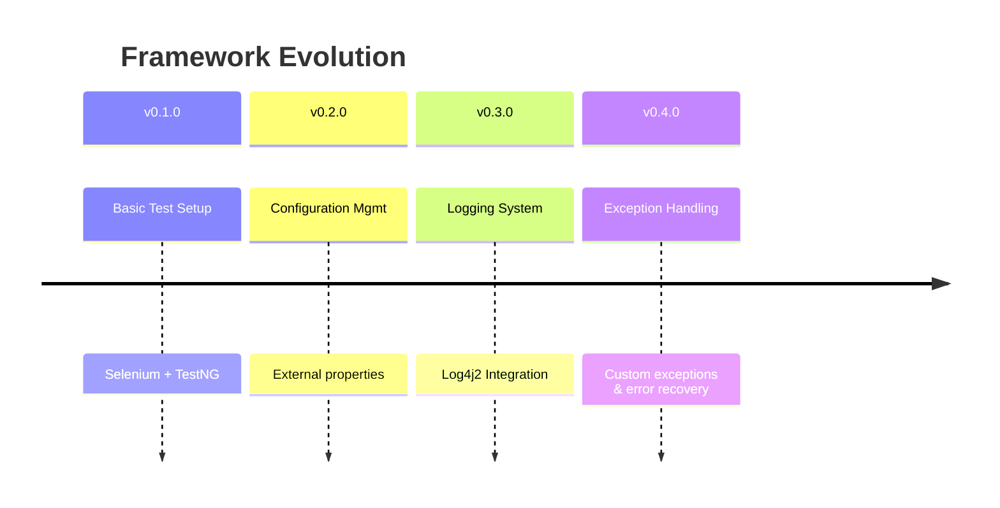
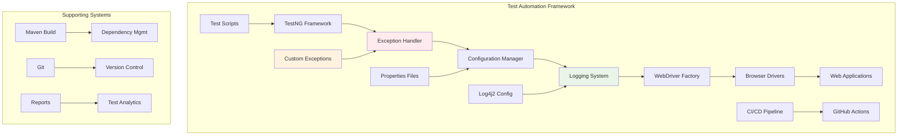
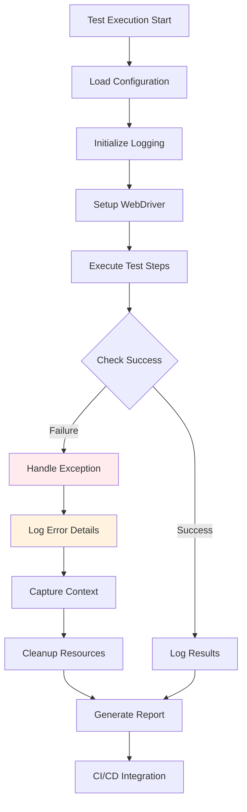
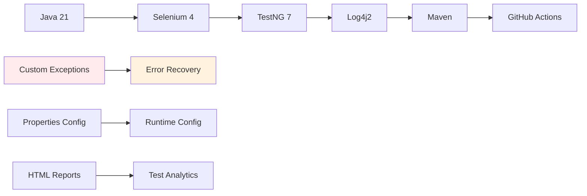
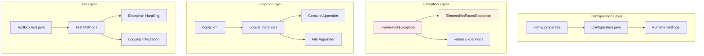
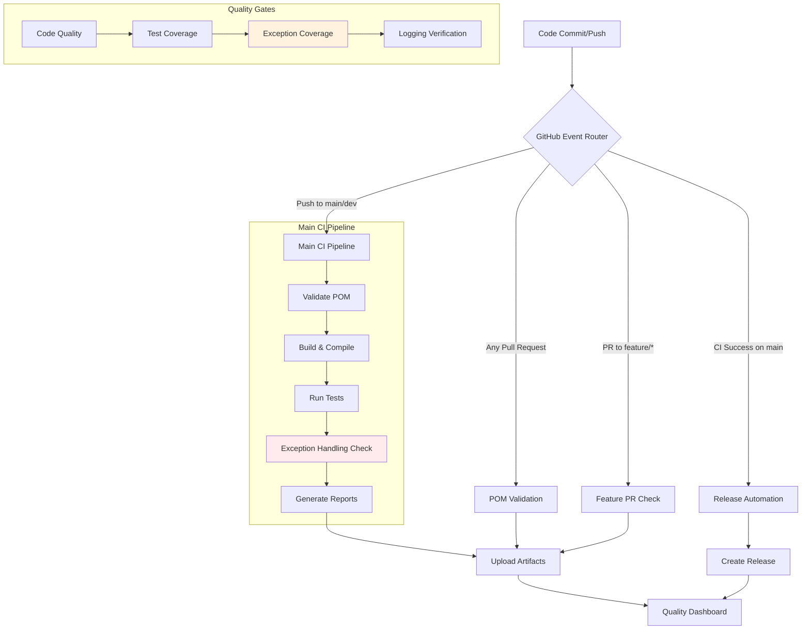
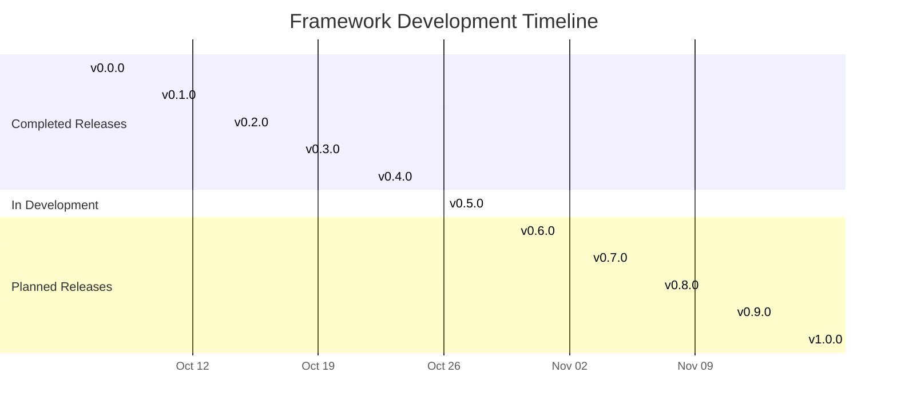
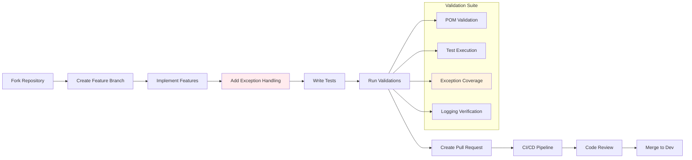

# 🚀 Hybrid Framework
> **Enterprise-grade test automation framework with robust exception handling, structured logging, and comprehensive CI/CD**
---
## 📦 Version & Activity
[](https://github.com/Anuj-Patiyal/hybrid-framework/releases)
[](https://github.com/Anuj-Patiyal/hybrid-framework/releases)
[](https://github.com/Anuj-Patiyal/hybrid-framework/commits)
[](https://github.com/Anuj-Patiyal/hybrid-framework/commits)

---

## ✅ CI/CD & Quality
[](https://github.com/Anuj-Patiyal/hybrid-framework/actions/workflows/main-ci.yml)
[](https://github.com/Anuj-Patiyal/hybrid-framework/actions/workflows/pom-validation.yml)
[](https://github.com/Anuj-Patiyal/hybrid-framework/issues)
[](https://github.com/Anuj-Patiyal/hybrid-framework/issues?q=is%3Aissue+is%3Aclosed)

---

## 🛠 Tech Stack


---

## 📊 Project Health
[](https://github.com/Anuj-Patiyal/hybrid-framework)
[](https://github.com/Anuj-Patiyal/hybrid-framework)
[](https://github.com/Anuj-Patiyal/hybrid-framework/blob/main/LICENSE)


---

## 📚 Table of Contents
1. 🚀 [Project Overview](#-project-overview)
2. 🏗️ [Architecture](#-architecture)
3. ✨ [Features](#-features)
4. 📁 [Project Structure](#-project-structure)
5. ⚡ [Quick Start](#-quick-start)
6. 🔧 [Configuration](#-configuration)
7. 🌿 [Branch Strategy](#-branch-strategy)
8. 🔄 [CI/CD Pipeline](#-cicd-pipeline)
9. 📊 [Milestones](#-milestones)
10. 🤝 [Contributing](#-contributing)
11. 👨‍💻 [Author](#-author)
12. 📜 [License](#-license)

---

## 🚀 Project Overview
### 🎯 What is This Framework?
A modern, scalable test automation framework built with Java, Selenium WebDriver, and TestNG, designed for enterprise-level testing with comprehensive error handling and reporting.

### 🏆 Current Release: v0.4.0
Robust Exception Handling Framework - Implementing structured error management across all framework components.

---

## 🏗️ Architecture
### 🔬 High-Level Architecture

### 🔄 Data Flow Architecture

---

## ✨ Features
## 🎯 Core Framework Features

| Feature                      | Version | Status      | Description                                    |
|------------------------------|---------|-------------|------------------------------------------------|
| **Exception Handling**       | v0.4.0  | ✅ Completed | Custom exceptions with graceful error recovery |
| **Structured Logging**       | v0.3.0  | ✅ Completed | Log4j2 with console & file appenders           |
| **Configuration Management** | v0.2.0  | ✅ Completed | Externalized properties file support           |
| **TestNG Integration**       | v0.1.0  | ✅ Completed | Test execution and reporting                   |
| **CI/CD Pipeline**           | v0.0.0  | ✅ Completed | GitHub Actions automation                      |

### 🔧 Technical Specifications

---

## 📁 Project Structure
### 🗂️ Complete Directory Layout
```text
hybrid-framework/
├── 📁 src/
│   ├── 📁 main/
│   │   └── 📁 resources/
│   │       └── 🎯 log4j2.xml                 # Logging configuration
│   └── 📁 test/
│       ├── 📁 java/
│       │   ├── 📁 config/
│       │   │   └── 🎯 Configuration.java     # Configuration manager
│       │   ├── 📁 exceptions/                # 🆕 Exception classes
│       │   │   ├── 🎯 FrameworkException.java
│       │   │   └── 🎯 ElementNotFoundException.java
│       │   └── 📁 tests/
│       │       └── 🎯 TextBoxTest.java       # Test with exception handling
│       └── 📁 resources/
│           └── 🎯 config.properties          # Test configuration
├── 📁 logs/                                  # Generated log files
├── 📁 .github/
│   ├── 📁 workflows/
│   │   ├── 🎯 main-ci.yml                   # CI pipeline
│   │   ├── 🎯 feature-pr.yml               # Feature validation
│   │   ├── 🎯 release-pr.yml               # Release automation
│   │   └── 🎯 pom-validation.yml           # POM validation
│   ├── 📁 issues/                           # Issue templates
│   ├── 📁 features/                         # Feature PR templates
│   └── 📁 releases/                         # Release templates
├── 🎯 pom.xml                               # Maven configuration
└── 🎯 README.md                             # Project documentation
```
### 🔍 Key Components Deep Dive

---

## ⚡ Quick Start
### 🚀 5-Minute Setup
```bash
# 1. Clone the repository
git clone https://github.com/Anuj-Patiyal/hybrid-framework.git
cd hybrid-framework

# 2. Verify setup
mvn --version
java --version

# 3. Run your first test
mvn clean test

# 4. Check results
ls -la logs/
cat logs/DemoQA.log
```
### ✅ Prerequisites Checklist
- Java 21 or higher installed
- Maven 3.6+ configured 
- Git for version control 
- Chrome/Firefox browsers available

### 🧪 Test Execution
```bash
# Run all tests
mvn clean test

# Run with specific profile
mvn test -Pci

# Generate reports
mvn surefire-report:report
```
---

## 🔧 Configuration
### ⚙️ Configuration Files
src/test/resources/config.properties
```properties
# =============================================
# BROWSER CONFIGURATION
# =============================================
browser=chrome
headless=true
window.width=1920
window.height=1080

# =============================================
# TEST ENVIRONMENT
# =============================================
base.url=https://demoqa.com
timeout.explicit=10
timeout.page.load=30

# =============================================
# LOGGING CONFIGURATION
# =============================================
logging.level=INFO
logging.file=logs/DemoQA.log
```
### 🎛️ Runtime Configuration
```java
// Access configuration in tests
String browser = Configuration.getBrowser();
boolean headless = Configuration.isHeadless();
String baseUrl = Configuration.getBaseUrl();

// Example usage with exception handling
try {
    driver.get(Configuration.getBaseUrl() + "/text-box");
} catch (FrameworkException e) {
    logger.error("Failed to navigate to URL: {}", e.getMessage());
    throw e;
}
```
---

## 🌿 Branch Strategy
### 🔀 Git Workflow

### 📋 Branch Types

| Branch Type | Purpose                    | Naming Convention        |
|-------------|----------------------------|---------------------------|
| **main**    | Production-ready releases  | `main`                    |
| **dev**     | Integration branch         | `dev`                     |
| **feature** | New features               | `feature/<description>`   |
| **release** | Release preparation        | `release/<version>`       |
| **hotfix**  | Critical fixes             | `hotfix/<description>`    |

---

## 🔄 CI/CD Pipeline
### 🏗️ Pipeline Architecture

### 📊 Pipeline Metrics

| Metric                 | Current | Target | Status |
|------------------------|---------|--------|--------|
| **Build Time**         | ~2m 30s | < 3m   | ✅      |
| **Test Pass Rate**     | 100%    | > 95%  | ✅      |
| **Exception Coverage** | 100%    | 100%   | ✅      |
| **Validation Checks**  | 28      | 30+    | 🚧     |

---

## 📊 Milestones
### 🎯 Release Timeline

### 🗓️ Version Roadmap
| Version | Feature            | Status         | Release Date | Progress |
|---------|--------------------|----------------|--------------|----------|
| v0.4.0  | Exception Handling | ✅ Completed    | Oct 22, 2025 | 🟢 100%  |
| v0.5.0  | Driver Management  | 🔄 In Progress | Oct 26, 2025 | 🟡 40%   |
| v0.6.0  | Page Object Model  | ⏳ Planned      | Oct 30, 2025 | ⚪ 0%     |
| v0.7.0  | Wait Utilities     | ⏳ Planned      | Nov 03, 2025 | ⚪ 0%     |
| v0.8.0  | Screenshot Utility | ⏳ Planned      | Nov 07, 2025 | ⚪ 0%     |
| v0.9.0  | TestNG Listeners   | ⏳ Planned      | Nov 11, 2025 | ⚪ 0%     |
| v1.0.0  | Allure Reporting   | ⏳ Planned      | Nov 15, 2025 | ⚪ 0%     |

---

## 🤝 Contributing
### 🔄 Contribution Workflow

### 📋 Contribution Guidelines
#### ✅ Code Standards
- Follow Java naming conventions
- Use custom exceptions appropriately
- Include comprehensive logging
- Write meaningful commit messages

#### ✅ Testing Requirements
- All new features must include tests
- Exception scenarios must be tested
- Maintain or improve test coverage
- Verify logging output

#### ✅ Documentation
- Update README for new features
- Document exception scenarios
- Include configuration changes
- Update architecture diagrams

#### 🎯 Pull Request Checklist
- Code Quality
- Custom exceptions used appropriately
- Error messages are descriptive
- Resource cleanup implemented
- Logging integrated properly

#### Testing
- All tests pass
- New tests added for features
- Exception scenarios covered
- CI/CD pipeline successful

#### Documentation
- README updated if needed
- Code comments added
- Configuration documented
- Architecture diagrams updated
---

## 👤 Author
### 🏆 ANUJ KUMAR
**QA Consultant & Test Automation Architect**

---

### 📬 Contact Details

| Type             | Details                                                              |
|------------------|----------------------------------------------------------------------|
| 📧 **Email**     | [anujpatiyal@live.in](mailto:anujpatiyal@live.in)                    |
| 🔗 **LinkedIn**  | [Anuj Kumar – QA](https://www.linkedin.com/in/anuj-kumar-qa/)        |
| 🏢 **GitHub**    | [Anuj-Patiyal](https://github.com/Anuj-Patiyal)                      |
| 💼 **Portfolio** | [Hybrid Framework](https://github.com/Anuj-Patiyal/hybrid-framework) |


---

## 📜 License
```text
Copyright (c) 2025 Anuj Kumar

Permission is hereby granted, free of charge, to any person obtaining a copy
of this software and associated documentation files (the "Software"), to deal
in the Software without restriction, including without limitation the rights
to use, copy, modify, merge, publish, distribute, sublicense, and/or sell
copies of the Software, and to permit persons to whom the Software is
furnished to do so, subject to the following conditions:

The above copyright notice and this permission notice shall be included in all
copies or substantial portions of the Software.

THE SOFTWARE IS PROVIDED "AS IS", WITHOUT WARRANTY OF ANY KIND, EXPRESS OR
IMPLIED, INCLUDING BUT NOT LIMITED TO THE WARRANTIES OF MERCHANTABILITY,
FITNESS FOR A PARTICULAR PURPOSE AND NONINFRINGEMENT. IN NO EVENT SHALL THE
AUTHORS OR COPYRIGHT HOLDERS BE LIABLE FOR ANY CLAIM, DAMAGES OR OTHER
LIABILITY, WHETHER IN AN ACTION OF CONTRACT, TORT OR OTHERWISE, ARISING FROM,
OUT OF OR IN CONNECTION WITH THE SOFTWARE OR THE USE OR OTHER DEALINGS IN THE
SOFTWARE.
```
### 💡 **Open Source Philosophy**
*"First, solve the problem. Then, write the code."* – John Johnson

This framework embodies robust engineering principles with enterprise-grade exception handling and structured logging for reliable test automation.

<div align="center">

🚀 **Ready to automate with confidence?**  
⭐ **Star this repository if you find it helpful!**

[🌟 Star on GitHub](https://github.com/Anuj-Patiyal/hybrid-framework) • [🐛 Report Issue](https://github.com/Anuj-Patiyal/hybrid-framework/issues) • [💡 Request Feature](https://github.com/Anuj-Patiyal/hybrid-framework/discussions)

</div>

```
---

